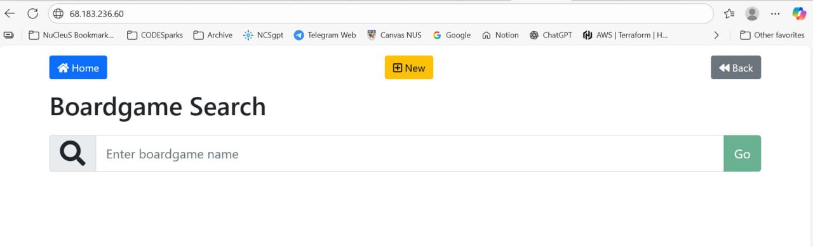
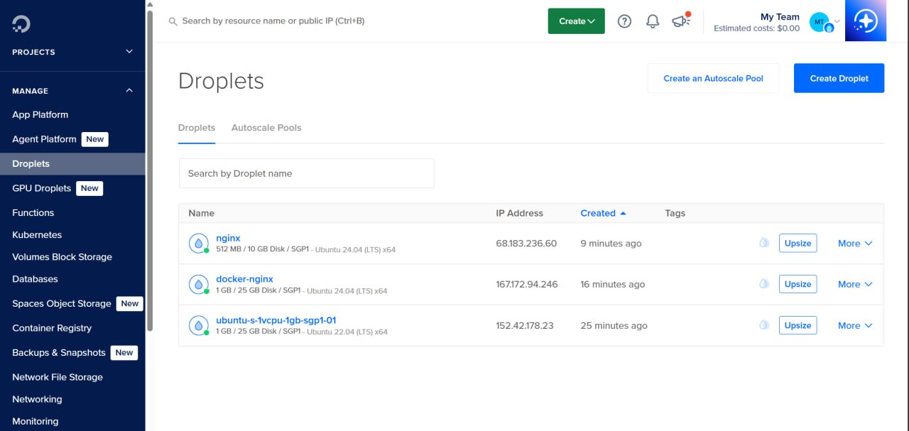

# Workshop 4 - Infrastructure as Code - Terraform Submission

## Instructions

Students are required to capture and upload the following screenshots to NUS Canvas:

### Screenshot 1

### Screenshot 2

## Submission

Please upload your screenshots to the designated NUS Canvas assignment folder.
